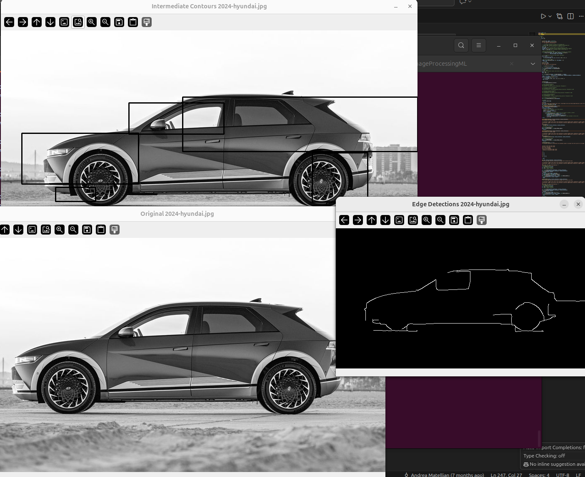

# ImageProcessingML
Use OpenCV to perform image edge and shape detections and then interpret results based on layout and composition. 

## Install
opencv-python
imutils

## To run
python processingFunctions.py

## Results

